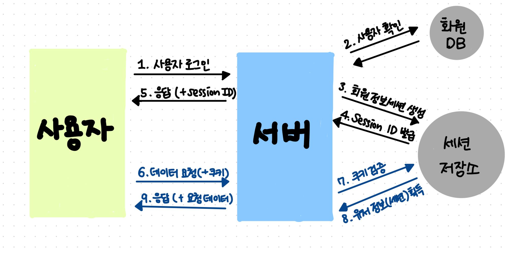
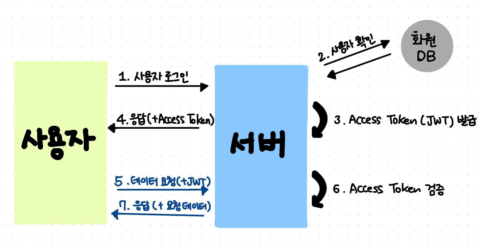
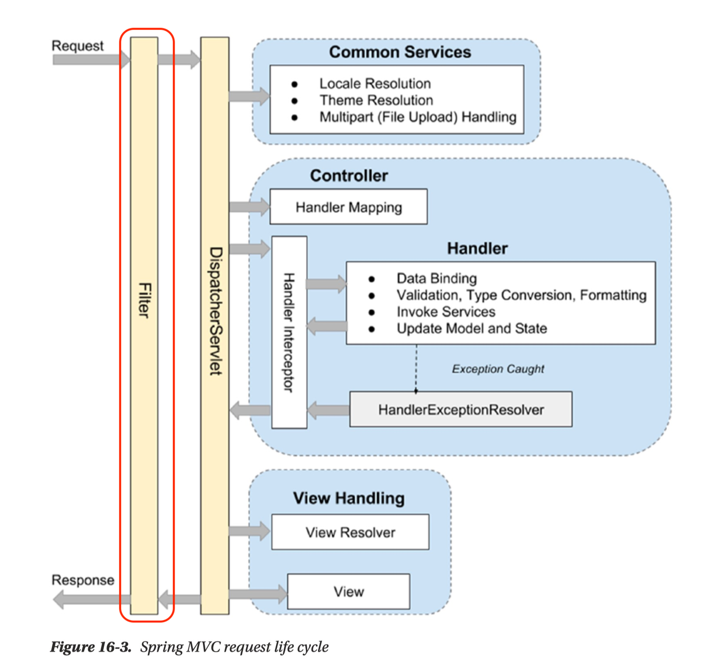
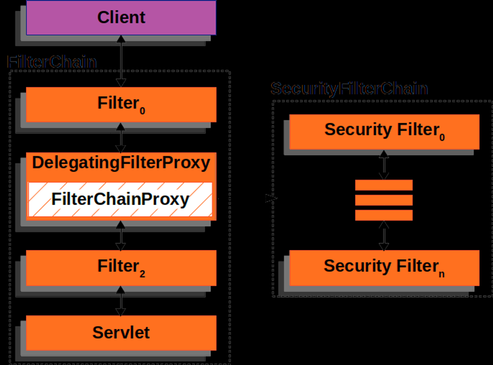

# 0705스프링정리

## 빈 수동등록

- 비즈니스 로직 빈이 아닌, 기술 지원빈들은 수동등록을 한다.

- 아마 인터페이스 레벨의 빈들 (구현체가 여러가지인 Bean) 은 구현체를 선택을 해야함

- 그래서 이 수동등록이 필요한듯 함.

## 같은 타입의 빈이 두개라면?

**[ 상황 ]**

- Food 인터페이스가 있고 구현체로 Pizza, Chicken 두개가 있음.

- 이 때 `@Autowired Food food` 는 어떤 빈을 주입할까?

    - 컴파일 에러가 발생함. 사용할 수 있는 빈이 2개이상이기 때문


### 해결 방법

- 변수명을 **빈 이름**으로 하면 빈 이름에 맞춰서 주입해준다. 

    - `@Autowired Food pizza`, `@Autowired Food chickend`

    - `@Autowired` 의 동작방식은 해당 타입으로 빈을 먼저 검색하고, 그다음에 변수명으로 이름을 검색한다.

- `@Configuration` 클래스에서 Food타입을 수동빈 등록해도 된다. (권장)

- `@Primary` 어노테이션 사용

- `@Qualifier` 어노테이션 사용

- 우선순위는 `@Qualifier`가  `@Primary` 보다 더 높다.

    - 여러 구현체를 사용해야 할 경우, 
    
      주로 사용되는걸 `@Primary`로 두고, 서브로 사용되는걸 `@Qualifier`로 가져오는게 편리하다.


## 인증과 인가

- 인증

    - 해당 유저가 실제로 그 유저인지 인증 (로그인)

- 인가

    - 해당 유저가 특정 리소스에 접근이 가능한지 허가 (관리자페이지)

## HTTP (비연결성과 무상태성)

**[ 비연결성 ]**

- 일반적인 HTTP 환경에서 서버와 클라이언트는 연결되어 있지 않다.

    - 예외 : 채팅, 게임과 같은 실시간 어플리케이션은 연결을 유지함(소켓)

- 연결을 계속 유지하는것은 서버 리소스 비용이 많이 들기 때문

**[ 무상태성 ]**

- 서버는 클라이언트의 상태를 저장하지 않음

- 클라이언트의 상태를 저장하면, SCALE-OUT 환경 적용이 어려움

## 두가지 인증방식 (로그인)

### 쿠키-세션 방식의 인증




**[TMI]**

- 쿠키 이름에는 공백을 포함할 수 없다.

    - 그래서 `URLEncoder` 를 사용해서 공백을 인코딩해서 사용한다.


### JWT토큰을 이용한 인증



- JWT 토큰 방식에서 중요한것은 `이 토큰이 유효한 토큰인가? 이다.`

- **'너 우리 서버에서 발급해준 토큰을 받아온거 맞아?'**

- 맞다면 이 토큰안의 있는 정보는 참이야 (토큰안의 정보는 userId, role 등을 저장)

- 암호화 알고리즘을 이용해서 구현


## JWT 좀더 알아보기

### 왜 세션 안쓰고 JWT 사용함?

- 스케일 아웃 환경에서 다루기 쉽다.

    - 리프레시 토큰까지 도입하게되면 JWT토큰도 결국 뒷단에 Redis를 두기는 한다. (세션방식처럼)

    - 하지만 Redis 호출횟수가 훨씬 적다. (만료시간에나 체크하기 때문)

- 모바일 환경을 고려

    - 보통 클라이언트는 세션ID를 브라우저 쿠키에 보관한다. 
    
    - 하지만 모바일 환경은 이런 저장공간이 별도로 지원되지 않는다.


## 스프링 필터(Filter) 계층



- 요청이 `DispatcherServlet`으로 넘어가기전에 Filter 계층을 거친다.

- 그리고 요청이 `Controller` (~`View`) 에서 처리되고, 응답을 내려주기 전에 다시 Filter 계층을 거친다.  

- 각 요청에 대한 공통처리가 필요할 때 필터를 등록해서 사용한다.

- 전처리 로직과 후처리 로직은 `chain.doFilter(request, response)` 위 아래로 구분된다.


```java
public void doFilter(ServletRequest request, ServletResponse response, FilterChain chain)
        throws IOException, ServletException {
    // 전처리 로직
    System.out.println("Pre-processing request");

    // 다음 필터 또는 서블릿으로 요청을 전달
    chain.doFilter(request, response);

    // 후처리 로직
    System.out.println("Post-processing response");

}
```

## 스프링 시큐리티 간단 요약

**[ Spring Securtiy 란?]**


- 서버에 필요한 인증 및 인가를 편하게 적용할수 있도록 도와줌

- 스프링 시큐리티를 사용하면 필터 계층에 `FilterChainProxy ` 를 만든다.

    - 이 `FilterChainProxy` 안에 우리는 여러 시큐리터 필터를 걸수 있다.

    - 이를 통해 인증과 인가를 제어한다.

    - 


## 인증과 관련된 주요 클래스 or 인터페이스

### UsernamePasswordAuthenticationFilter

- 스프링 시큐리티에서 로그인이 진행되는 필터이다.

- 보통 로그인 기능을 커스텀해서 사용하려고 하면, 이 필터를 상속받아서 사용한다.

- 인증 방식은 `AuthenticationManager`를 불러와서 `authenticate(authRequest)` 메서드를 호출하는 방식이다. 

- 직접적으로 이 필터에서 모든 인증 프로세스를 구현하지 않고, `AuthenticationManager`에 위임한다.

    - 스프링 시큐리티에서 이런식으로 구현한것은 id, password 방식 말고도 다른 인증방법을 사용하는 것을 고려한 것으로 보인다.

- 실제 코드

    ```java
        ...
        //http request에서 username과 passowrd를 추출한 다음 인증토큰을 만든다.
		UsernamePasswordAuthenticationToken authRequest = UsernamePasswordAuthenticationToken.unauthenticated(username, password);

        //인증토큰 정보를 바탕으로 AuthenticationManager 에게 인증을 요청한다.
		return this.getAuthenticationManager().authenticate(authRequest);
    ```

- 그러면 인증 절차는 `AuthenticationManager`가 해주면 저희는 어떤거를 신경써야 하나요?

    - (토큰방식을 사용할 경우) 로그인 이후 토큰을 쿠키에 넣어줄것인가? 헤더에 넣어줄 것인가?

    - 로그인 API의 엔드포인트에 해당하는 요청이 아닐경우 이 필터는 스킵처리 되어야한다.

    - 로그인 실패후 응답을 어떻게 내려줄 것인가

    - 로그인 성공후 응답을 어떻게 내려줄 것인가

### AuthenticationManager

```java
public interface AuthenticationManager {
	Authentication authenticate(Authentication authentication) AuthenticationException;
}

```
- **인증되지 않은** `Authentication` 객체를 받아서  **인증된** `Authentication` 객체를 반환한다.

- 인증이 된 `Authentication` 객체는 승인된 `Authorities` 들이 포함되어 있다.

- `authenticate` 메서드 호출 중에 `AuthenticationException`이 발생할 수 있다.

    - `DisabledException` : 계정이 비활성화 된 경우

    - `LockedException` : 계정에 락이 걸려있을 때

    - `BadCredentialsException` : Credentials 정보가 잘못되었을 때

        - 여기서 Credentials은 비밀번호와 같은 암호학적 개인정보를 의미

    - 어떻게 위와같은 예외 케이스를 자세히 분류할수 있을까? 아래에서 천천히 설명

### ProviderManager

- `AuthenticationManager` 에서 디폴트로 사용되는 구현체 인 듯 하다.

- 이 `ProviderManager`는 멤버변수로 여러 `AuthenticationProvider`를 유지하고 있다 

    - `private List<AuthenticationProvider> providers`

- 실제로 인증을 진행하는것은 이 `AuthenticationProvider` 들이다.

- 실제 인증 코드

    ```java

        ...
        //Provider 목록을 순회하면서, 어떤 provider로 인증을 할지 결정함.
        for (AuthenticationProvider provider : getProviders()) {
			if (!provider.supports(toTest)) {
				continue;
			}
			if (logger.isTraceEnabled()) {
				logger.trace(LogMessage.format("Authenticating request with %s (%d/%d)",
						provider.getClass().getSimpleName(), ++currentPosition, size));
			}
			try {
                
                //실제로 인증을 하는 부분
				result = provider.authenticate(authentication);
				if (result != null) {
					copyDetails(authentication, result);
					break;
				}
			}
        ...
    ```

### DaoAuthenticationProvider

- `AuthenticationProvider` 중 하나이다. 시큐리티에서 **디폴트**로 사용된다.

- `UserDetailsService`를 사용해서 인증을 진행한다.

    - 개인적으론 약간 서로 강결합 으로 묶여있는 느낌이다.

- `Dao` 라는 의미에서 알 수 있듯이 DB단에서 유저를 조회한 것을 토대로 인증을 진행

### UserDetailsService

```java
public interface UserDetailsService {
	UserDetails loadUserByUsername(String username) throws UsernameNotFoundException;
}
```

- username 을 통해 유저를 불러와야한다. 

    - `UserDetails`는 User에 대한 여러 정보를 알려주는 또다른 인터페이스이다.

    - ex) `password` , `계정 Lock` , `권한(Authorites)` 과 같은 정보들을 `UserDetails`를 통해 조회할 수 있다.

- **이 인터페이스는 시큐리티를 사용하는 개발자가 직접 구현해야하는 인터페이스이다.**

- 보통 `UserRepository`를 통해서 User객체를 불러오는 식으로 구현한다.

### UserDetails

- `Provides core user information.`

- UserDetails 또한 역시 **시큐리티를 사용하는 개발자가 직접 구현해야하는 인터페이스**이다.

- 보통 프로젝트 내에서 사용하는 `UserEntity` 를 has-a 로 포함시켜 구현한다.

- 위에서 `AuthenticationManager`가 어떻게 다양한 예외정보를 던져줄 수 있을까? 라고 했었다.

  - 그 이유는 이 인터페이스에서 유저에 대한 디테일한 정보들을 다 조회할 수 있기 때문이다.


### 요약

- 그래서 일반적인 username과 password를 이용해 인증을 할 경우, 개발자는 `UserDetails` 와 `UserDetailsService` 인터페이스를 구현해야한다.

- 추가로 `UsernamePasswordAuthenticationFilter` 를 상속해서 재정의 한다.

    - 이렇게 구현한 필터들은 시큐리티 설정클래스에서 걸어주어야 한다. (이부분은 생략) 

- 이 정보가 있으면 위에 서술된 방식으로, 스프링시큐리티가 인증을 진행한다.


- `UserDetails` 구현 코드 예시

    ```java
    public class UserDetailsImpl implements UserDetails {

    private final User user;

    public UserDetailsImpl(User user) {
        this.user = user;
    }

    public User getUser() {
        return user;
    }

    @Override
    public String getPassword() {
        return user.getPassword();
    }

    @Override
    public String getUsername() {
        return user.getUsername();
    }

    @Override
    public Collection<? extends GrantedAuthority> getAuthorities() {
        UserRoleEnum role = user.getRole();
        String authority = role.getAuthority();

        SimpleGrantedAuthority simpleGrantedAuthority = new SimpleGrantedAuthority(authority);
        Collection<GrantedAuthority> authorities = new ArrayList<>();
        authorities.add(simpleGrantedAuthority);

        return authorities;
    }
    ```

- `UserDetailsService` 구현 코드 예시

    ```java
    @Service
    public class UserDetailsServiceImpl implements UserDetailsService {

        private final UserRepository userRepository;

        public UserDetailsServiceImpl(UserRepository userRepository) {
            this.userRepository = userRepository;
        }

        @Override
        public UserDetails loadUserByUsername(String username) throws UsernameNotFoundException {
            User user = userRepository.findByUsername(username)
                    .orElseThrow(() -> new UsernameNotFoundException("Not Found " + username));

            return new UserDetailsImpl(user);
        }
    }
    ```
